# ahmed_defense_1.2.9

- Source: `ahmed_defense_1.2.9.pptx`
- Total slides: 30

## Slide 1

MACHINE LEARNING BASED ALGORITHM SELECTION FOR

SORTING NUMERIC ARRAYS

Presented by

AHMED SALAH ABDALHI MOHAMMED

Supervised by

Assoc. Prof. Dr. Emre Özbilge

1/30

### Speaker Notes

This thesis is about a small decision that happens before sorting: which implementation should we use for this input array. I will keep coming back to three numbers: the model closes 93.1 percent of the runtime gap, reaches 76.1 percent test accuracy, and makes zero-regret decisions for 89.6 percent of the test cases.

## Slide 2

Presentation Outline

Problem, Motivation, and Prior Work

Evaluation: SBS, VBS, Regret

01

04

Data Collection, Labels, and Features

Rigor, Generalisation, and Scope

02

05

Algorithm Selection Task and v5 Selector

Contributions, Limits, and Q&A

03

06

2/30

### Speaker Notes

I will first explain the task and why it matters. Then I will explain the data, the extracted features, and the model. After that I will defend the result with runtime metrics, then show the limits and what I do not claim.

## Slide 3

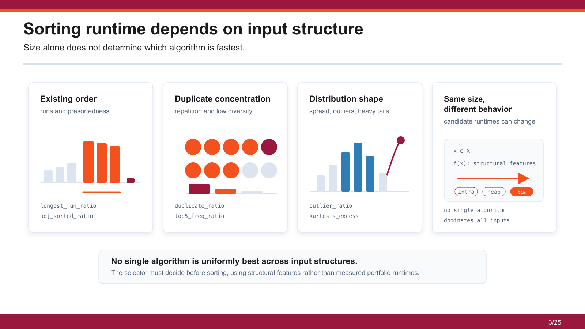

3/30

## Slide 4

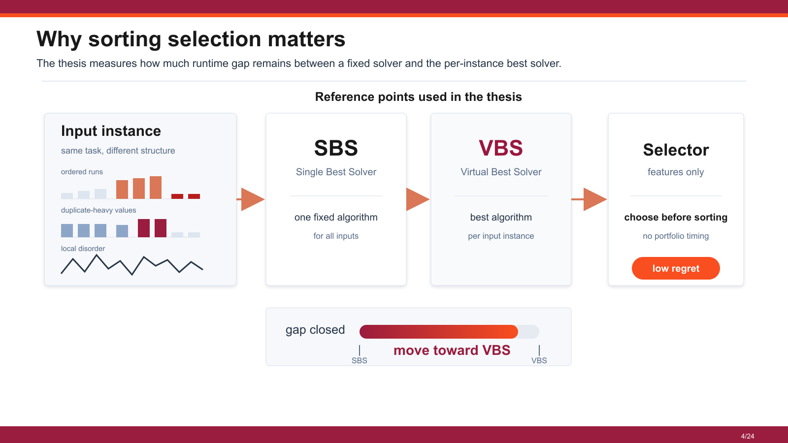

4/30

### Speaker Notes

This matters because the same input size can have different structure. A sorted-like array, random array, and duplicated array can reward different algorithms. So the useful target is not only classification accuracy; it is how much runtime loss we avoid compared with the best per-input choice.

## Slide 5

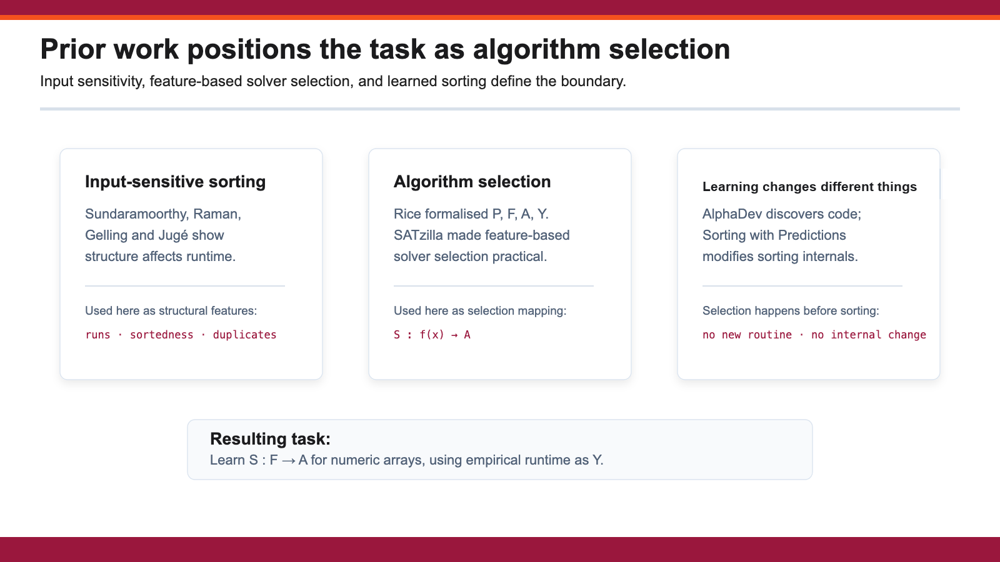

5/30

### Speaker Notes

The work connects to algorithm selection, adaptive sorting, and learned performance prediction. I am not presenting literature as a separate survey. I use it to position the task: previous work gives the idea of selecting from features, and this thesis applies that idea to measured sorting behavior.

## Slide 6

The corpus uses five structurally diverse real-world domains

1,188,265 numeric arrays were extracted to maximise structural diversity.

1.18M

labeled array instances

Cryptocurrency OHLCV

Formula 1 telemetry

Equity prices

Weather

Seismic measurements

Real data was preferred because synthetic distributions failed to converge to genuine structure.

6/30

### Speaker Notes

The dataset was built from five domains: F1 telemetry, stock, crypto, earthquake, and weather. The reason for using multiple domains was to avoid building a selector that only understands one family of arrays.

## Slide 7

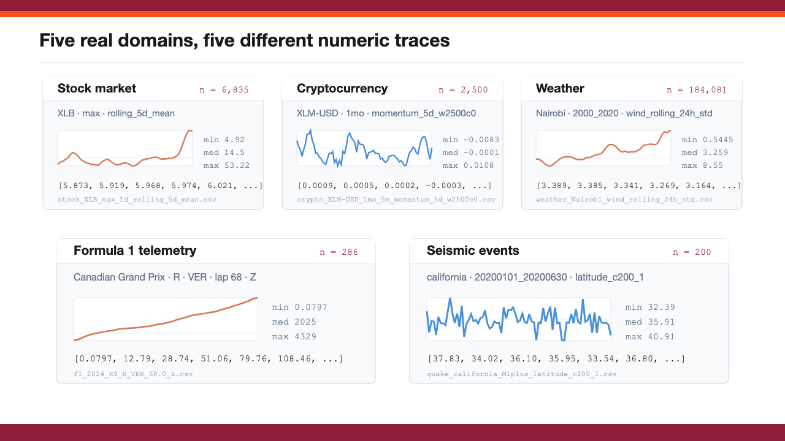

## Slide 8

Labels are empirical fastest-algorithm measurements

Each candidate algorithm is timed on a fresh copy; the minimum observed runtime becomes the label.

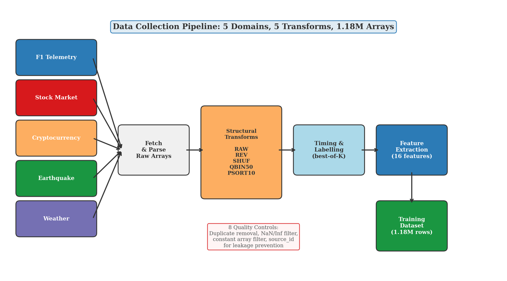

RAW

REV

SHUF

QBIN50

PSORT10

RAW, REV, SHUF, QBIN50, and PSORT10 force a non-trivial decision boundary.

8/30

### Speaker Notes

For each domain, I generated transformed arrays and measured runtime across the three sorting algorithms. The label is not guessed; it is the fastest measured algorithm for that instance. The transformations create raw, reversed, shuffled, quantized, and partially sorted cases.

## Slide 9

Sixteen O(n) structural features characterise each array

Every feature must be cheap to compute and linked to differential sorting behaviour.

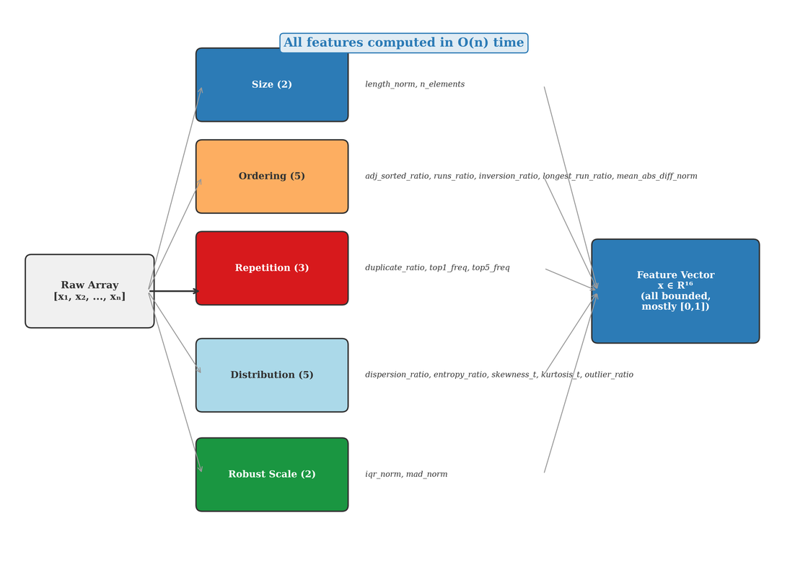

Size

Ordering

length_norm

adj_sorted_ratio

size effects

runs_ratio

cache / constants

inversion_ratio

Timing features are excluded at prediction time.

A single canonical feature extractor is shared across data generation, training, and inference.

9/30

### Speaker Notes

The features are the bridge between the raw array and the model. They describe scale, order, duplicates, runs, inversions, and distribution. The important point is that these are structural features, not timing features.

## Slide 10

Prediction is made before any candidate algorithm is executed

The selector extracts features once, runs one XGBoost prediction, and chooses one portfolio member.

Allowed before sorting

Not allowed at prediction time

Extract O(n) features

Sort with introsort

Measure order, runs, repetition, distribution, robust scale

Sort with heapsort

Sort with timsort

Predict introsort, heapsort, or timsort

Pick after seeing all times

The oracle is used only for evaluation; it is not available at run time.

10/30

### Speaker Notes

At prediction time, the selector cannot sort the array with all three algorithms and then choose the fastest. That would be the oracle, not a usable method. The selector must use cheaper information from the input before sorting.

## Slide 11

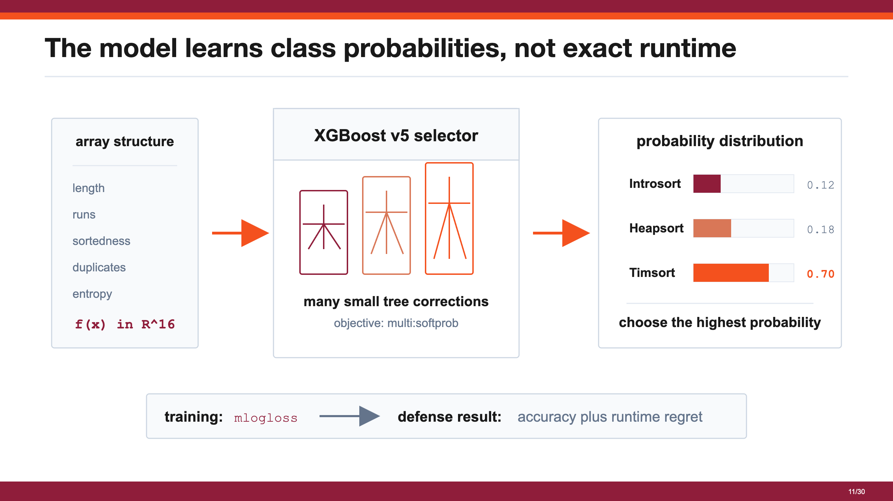

## Slide 12

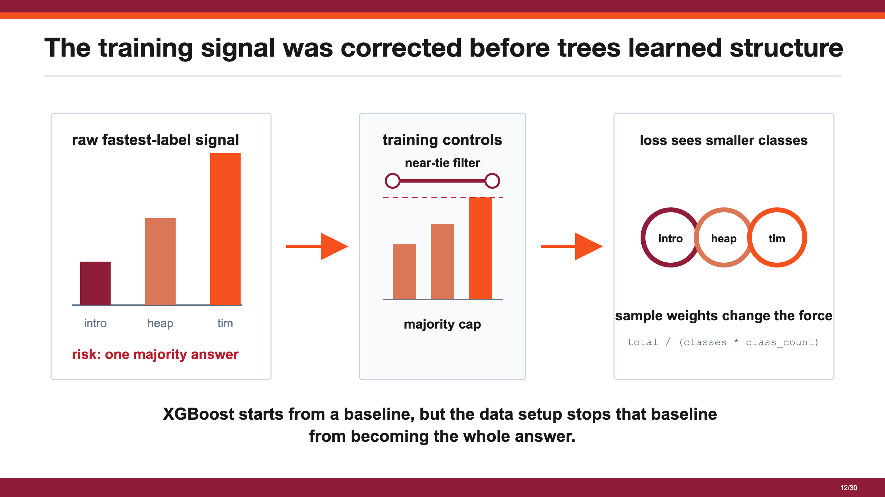

## Slide 13

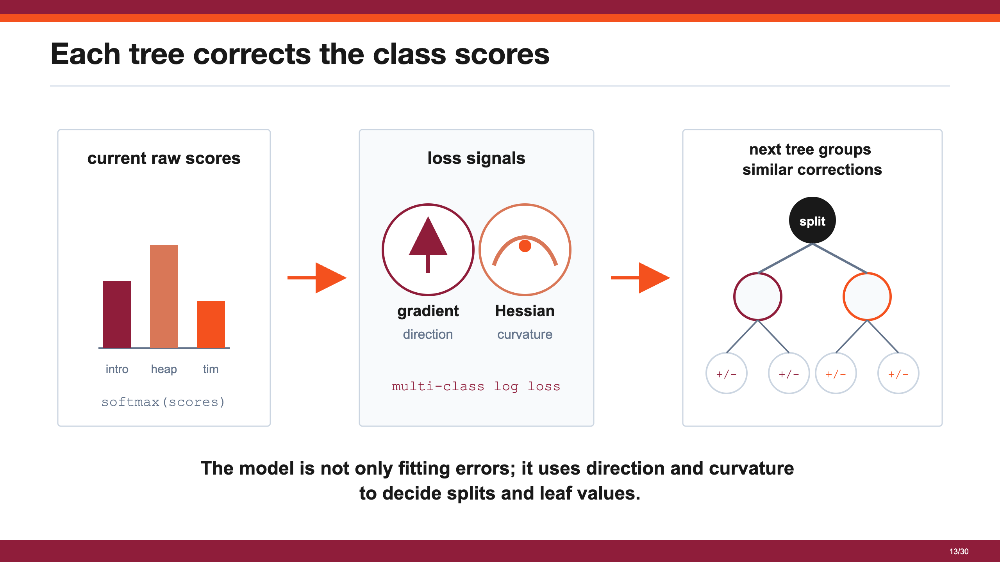

## Slide 14

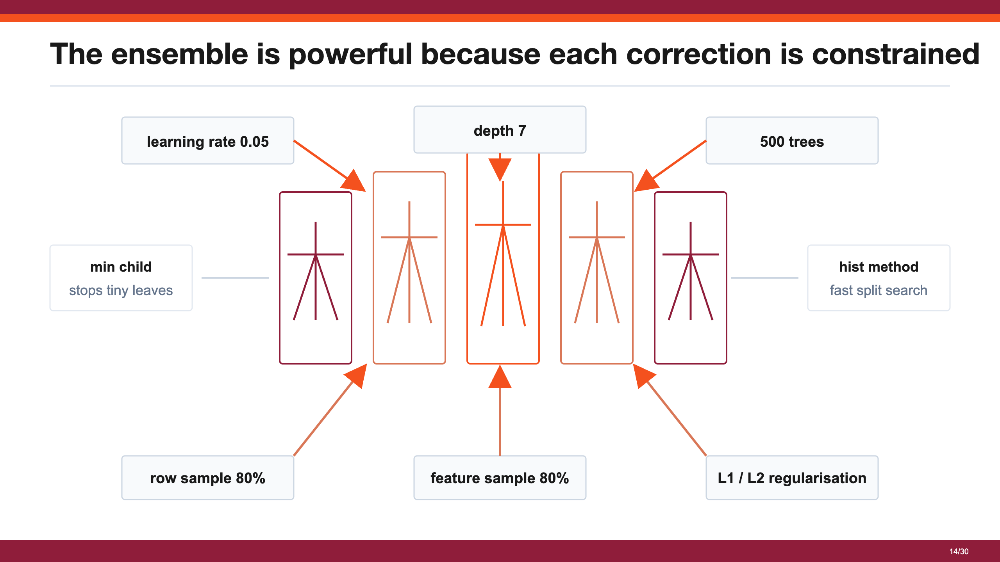

## Slide 15

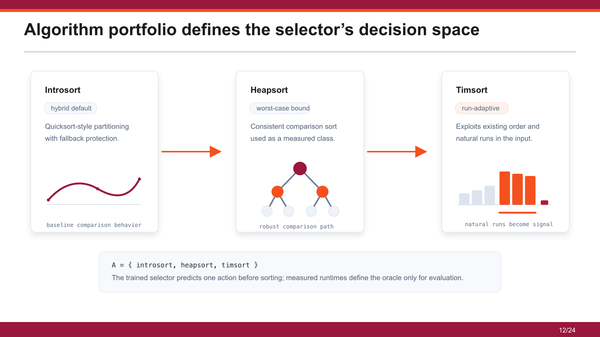

15/30

### Speaker Notes

The portfolio is deliberately limited to three real implementations: introsort, heapsort, and timsort. The model is not choosing from every sorting algorithm in theory. It is choosing from the measured implementations in this experiment.

## Slide 16

Algorithm Selection Problem

Problem space P

Feature space F

Algorithm space A

Selector

numeric array

structural array features

[4, 5, 5, 6, 17, 18,

S : F → A

Introsort

size

19, 2, 2, 3, 31, 45]

sortedness / disorder

runs

Heapsort

XGBoost classifier

duplicates / entropy

predict fastest class

spread / outliers

Timsort

order, runs, duplicates, spread

x ∈ R^16

Performance space Y

Introsort

Heapsort

Timsort

label from measured runtime

18.7 μs

24.5 μs

13.2 μs

label(x) = argmin_a T(a, x)

16/30

### Speaker Notes

The task is not to invent a new sorting algorithm. The task is: given one array before sorting, choose introsort, heapsort, or timsort. The model sees cheap structural features and outputs one algorithm choice.

## Slide 17

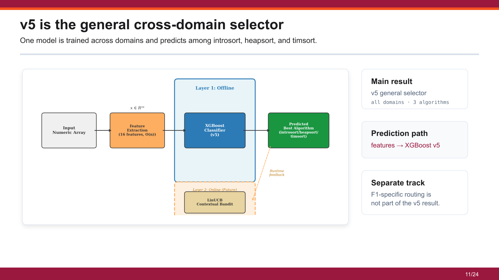

17/30

### Speaker Notes

The main system is v5. It is one general XGBoost classifier trained across all domains and choosing among the three algorithms. The F1-specific route is separate and I will only mention it as a specialization, not the main result.

## Slide 18

Model evolution reduced the problem to its deployable form

Regression, timing features, source-aware checks, regret-aware loss, and cascade tests define why v5 is retained.

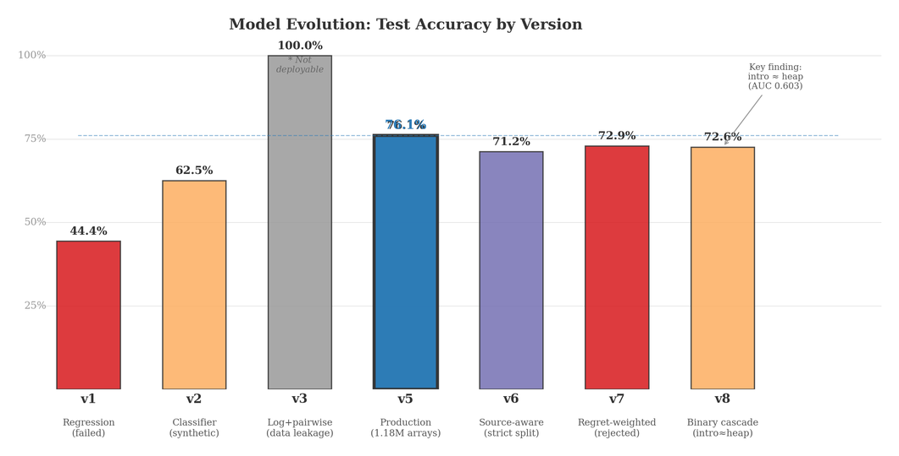

v1 regressor

timing-feature model

v5 XGBoost classifier

v6 / v7 / v8 checks

100%; non-deployable

main reported selector

leakage, objective, boundary

44.4%; size dominated

18/30

### Speaker Notes

The final model came after earlier paths were rejected. Regression was not strong enough, timing features were not deployable, and strict checks changed the interpretation. v5 became the main model because it gave the best practical balance under the submitted evaluation.

## Slide 19

Evaluation measures distance from SBS to VBS

Accuracy is reported, but selector quality is judged by regret and gap closed.

SBS

VBS

Model

best fixed algorithm

oracle fastest algorithm

choose before execution

over the evaluation set

for each array

using structural features

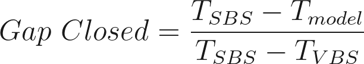

Gap closed gives the fraction of the SBS-to-VBS improvement captured by the selector.

19/30

### Speaker Notes

SBS means one algorithm used for all test inputs. VBS means the fastest measured algorithm per input, which is an oracle for evaluation. The model is judged by how close it gets to VBS without having oracle information at prediction time.

## Slide 20

The v5 selector closes most of the SBS-to-VBS gap

The reported result is 76.1% top-1 accuracy, 93.1% gap closed, and 89.6% zero regret.

76.1%

89.6%

93.1%

top-1 accuracy

zero-regret predictions

SBS-to-VBS gap closed

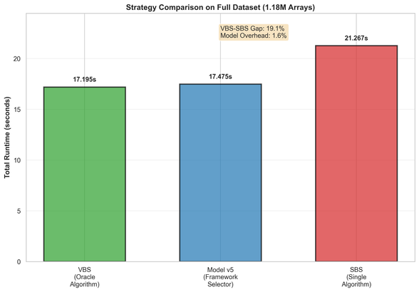

Regret, not only accuracy,

is the main evaluation signal.

20/30

### Speaker Notes

The main result is runtime value: v5 closes 93.1 percent of the gap between SBS and VBS. Accuracy is 76.1 percent, but this does not tell the whole story. The zero-regret rate is 89.6 percent, which shows many decisions are either correct or not costly.

## Slide 21

Accuracy alone is insufficient for algorithm selection

A wrong label can be harmless when the selected and optimal algorithms have nearly equal runtimes.

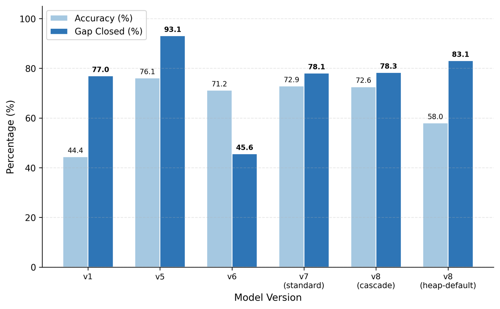

76.1%

top-1 accuracy

93.1%

SBS-to-VBS gap closed

The result is evaluated by regret and gap closed, not accuracy alone.

21/30

### Speaker Notes

This slide explains why I do not defend the model only as a classifier. Some label mistakes happen between algorithms whose measured runtimes are very close. In those cases, the label is wrong, but the runtime regret is small.

## Slide 22

Residual error is concentrated at the introsort-heapsort boundary

Timsort has a strong structural trace; introsort and heapsort often depend on lower-level effects.

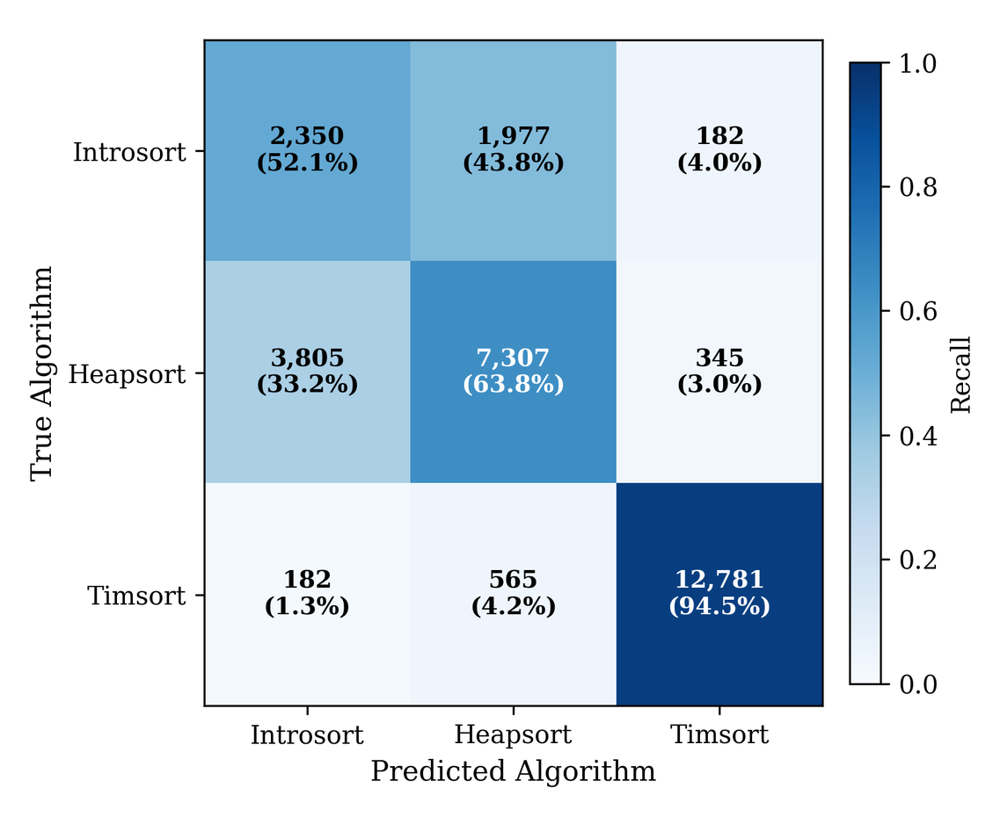

94.5%

timsort recall

Interpretation

timsort is separable when runs/order are visible.

introsort and heapsort remain close in the current feature space.

Most residual boundary errors

carry low measured regret.

22/30

### Speaker Notes

The confusion matrix shows that timsort is often easier to identify when order signals are strong. The harder boundary is between introsort and heapsort because their runtime behavior is often closer. This is a limitation, but it is also why regret is necessary.

## Slide 23

Feature importance follows structural sorting signals

Length, repetition, and ordering account for most of the discriminative signal.

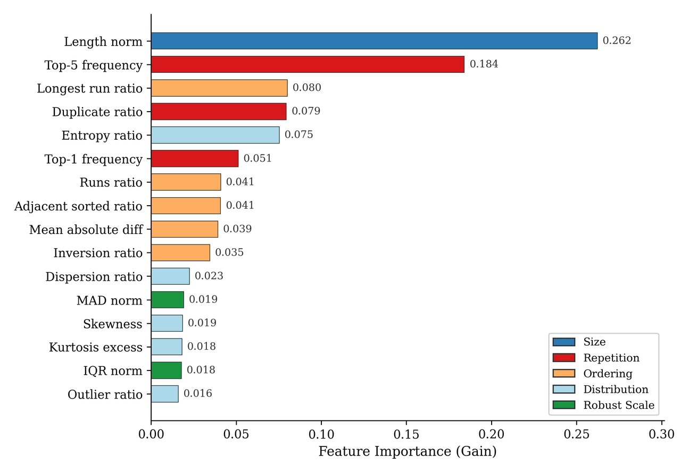

Ordering

- longest_run_ratio
- runs_ratio
- adj_sorted_ratio

Repetition / diversity

- top5_freq_ratio
- duplicate_ratio
- entropy_ratio

Size / scale

- length_norm
- robust scale descriptors

23/30

### Speaker Notes

Feature importance shows that the model is using structural signals. This supports the method because the important features relate back to the properties that sorting algorithms react to: order, duplicates, distribution, and size.

## Slide 24

Leave-one-domain-out testing supports cross-domain robustness

Each fold trains on four domains and tests on the unseen fifth domain.

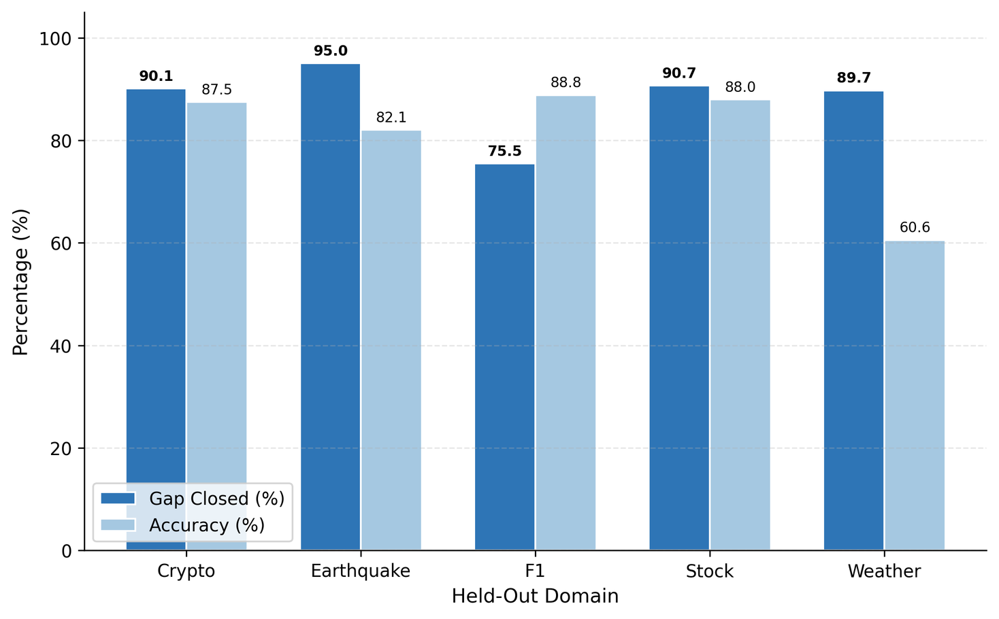

>75%

gap closed in every fold

F1 sensitivity

F1 telemetry is the weakest

held-out fold because it contains

many distinct channel regimes.

24/30

### Speaker Notes

Domain holdout is stricter because the held-out domain is unseen during training. The weighted gap closed is 79.7 percent. F1 is harder than the other domains, and that is why the F1-specific route exists separately.

## Slide 25

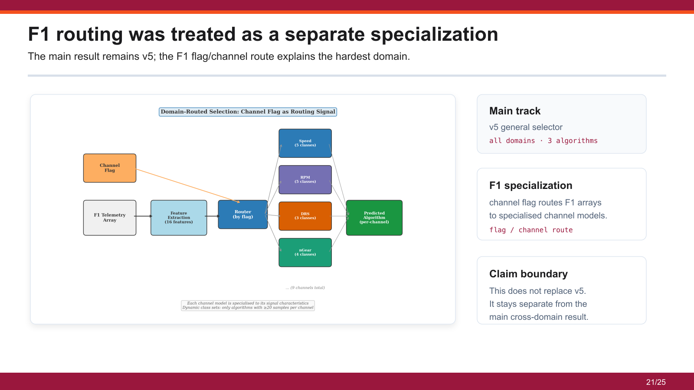

25/30

## Slide 26

Strict checks define the boundary of the reported result

The reported result stays with v5; later variants explain leakage risk, objective risk, and the hard boundary.

v6 source-aware

v7 regret-aware

v8 cascade

71.2% accuracy; 45.6% gap closed.

regret-weighted loss

Stage 2 AUC = 0.603

source separation became

was less stable:

for introsort vs heapsort;

part of the evaluation protocol.

78.1% gap closed.

Stage 1 AUC = 0.982.

v5 remains the reported selector; v6, v7, and v8 are evidence for limits, not replacement results.

26/30

### Speaker Notes

The negative results are part of the rigor. v6 checked source-awareness, v7 showed that a regret-aware attempt did not improve the final result, and v8 showed that the intro-versus-heap boundary remains difficult. These results keep the claim measured.

## Slide 27

Conclusion

Sixteen O(n) structural features are enough to support useful per-instance sorting decisions.

The selector improves practical runtime even when top-1 accuracy is imperfect.

76.1%

93.1%

89.6%

top-1 accuracy

SBS-to-VBS gap closed

zero-regret predictions

The strongest cases are arrays where order, runs, and repetition leave a visible structural trace.

The main residual weakness is the introsort-heapsort boundary, where current value-level features miss microarchitectural effects.

27/30

### Speaker Notes

My claim is that v5 closes most of the measured runtime gap with cheap structural features and known limitations. I do not claim a perfect classifier, I do not claim the F1 route is the main result, and I do not claim LinUCB is validated in this thesis.

## Slide 28

Contributions

The contributions are the selector, the evaluation discipline, and the reproducible artefact.

A deployable selector

01

A compact pipeline combines sixteen O(n) structural features with a gradient-boosted classifier.

A rigorous evaluation framework

02

Source-level separation, near-tie filtering, LODO testing, and regret metrics give a stronger view than accuracy alone.

A reproducible artefact

03

One source-of-truth feature extractor, data pipeline, and exported XGBoost JSON / ONNX models support replication.

28/30

### Speaker Notes

The contribution is the framing, the data and feature pipeline, and the measured selector result. The future work is stronger domain adaptation, validated online selection, and deeper F1-specific evaluation.

## Slide 29

Limitations and Future Work

The limits are portfolio scope, single hardware setting, unvalidated online adaptation, and small-array overhead.

Limitations

Future work

01

portfolio limited to three C-level comparison sorts

05

larger portfolios: Powersort, radix/bucket guards, SIMD/GPU sorts

02

absolute regret tied to one hardware/software environment

06

validated LinUCB under gradual and abrupt distribution shift

03

LinUCB contextual bandit designed but not validated

07

domain embeddings and stricter channel-level routing evaluation

04

feature extraction becomes unprofitable below about 1,000 elements

08

cross-platform deployment with feature-extraction overhead

Future work extends the portfolio, adaptation, and generalisation axes while preserving cost-aware evaluation.

29/30

## Slide 30

Thank you

Questions?

30/30
